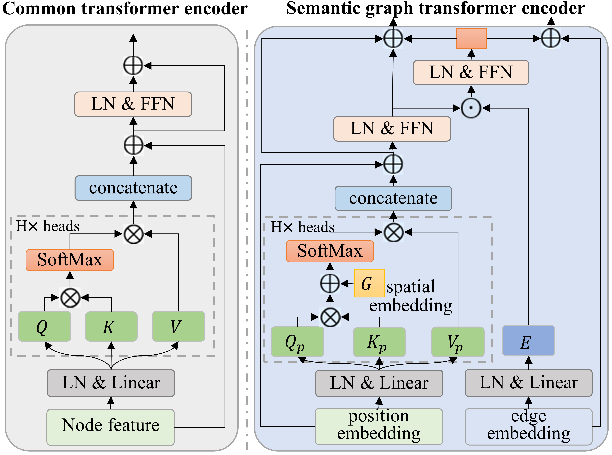

# Deep Semantic Graph Transformer for Multi-view 3D Human Pose Estimation [AAAI 2024]

<p align="center"></p>

> **Deep Semantic Graph Transformer for Multi-view 3D Human Pose Estimation**,        
> Lijun Zhang, Kangkang Zhou, Feng Lu, Xiang-Dong Zhou, Yu Shi,        
> *The 38th Annual AAAI Conference on Artificial Intelligence (AAAI), 2024*

## TODO
- The paper will be released soon!
- Test code and model weights will be released soon!

## Release
- [14/12/2023] We released the model and training code for SGraFormer.

## Installation

- Create a conda environment: ```conda create -n SGraFormer python=3.7```
- Download cudatoolkit=11.0 from [here](https://developer.nvidia.com/cuda-11.0-download-archive) and install 
- ```pip3 install torch==1.7.1+cu110 torchvision==0.8.2+cu110 -f https://download.pytorch.org/whl/torch_stable.html```
- ```pip3 install -r requirements.txt```

## Dataset Setup

Please download the dataset from [Human3.6M](http://vision.imar.ro/human3.6m/) website and refer to [VideoPose3D](https://github.com/facebookresearch/VideoPose3D) to set up the Human3.6M dataset ('./dataset' directory). 
Or you can download the processed data from [here](https://drive.google.com/drive/folders/1F_qbuZTwLJGUSib1oBUTYfOrLB6-MKrM?usp=sharing). 

```bash
${POSE_ROOT}/
|-- dataset
|   |-- data_3d_h36m.npz
|   |-- data_2d_h36m_gt.npz
|   |-- data_2d_h36m_cpn_ft_h36m_dbb.npz
```

## Quick Start
To train a model on Human3.6M:

```bash
python main.py --frames 27 --batch_size 1024 --nepoch 50 --lr 0.0002 
```

## Citation
If you find our work useful in your research, please consider citing:

    @inproceedings{
        The 38th Annual AAAI Conference on Artificial Intelligence (AAAI)
        author = {Lijun Zhang, Kangkang Zhou, Feng Lu, Xiang-Dong Zhou, Yu Shi},
        title = {Deep Semantic Graph Transformer for Multi-view 3D Human Pose Estimation},
        year = {2024},
        }
    

## Acknowledgement

Our code is extended from the following repositories. We thank the authors for releasing the codes. 

- [PoseFormer](https://github.com/zczcwh/PoseFormer)
- [VideoPose3D](https://github.com/facebookresearch/VideoPose3D)

